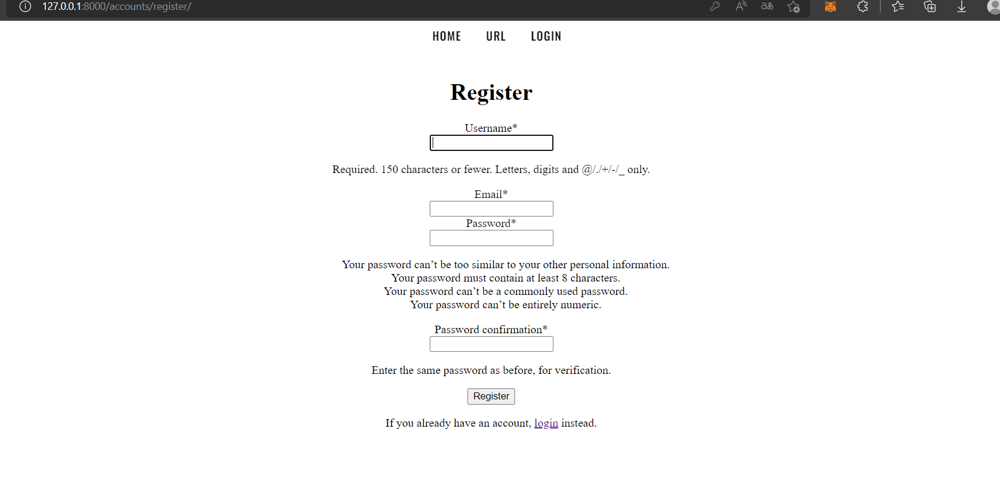
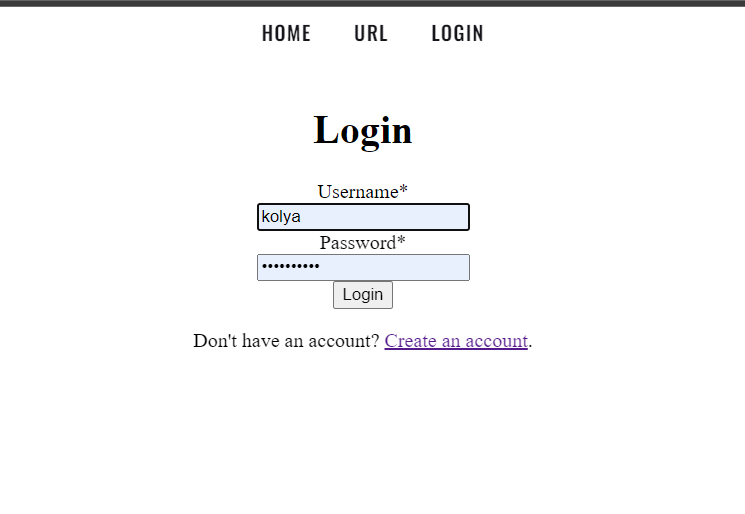
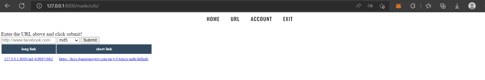
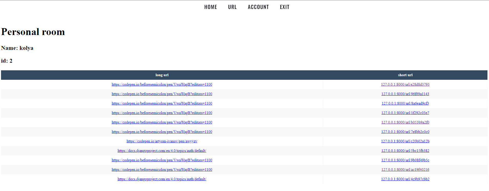
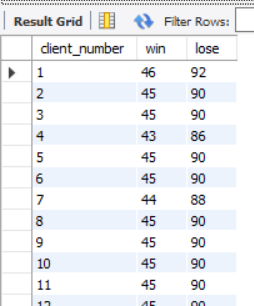
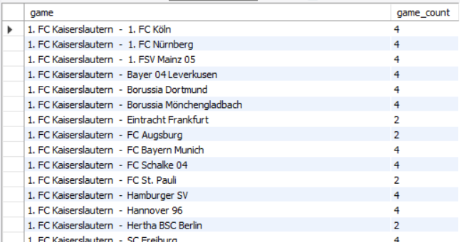

# Тестовая работа
Первое задание храниться в папке ./mysite. 

Второе задание в папке ./task2(DB)

## Задание 1 (Django)
### Функционал
Данное приложение предназначено для сокращения ссылок. В нем
присутствует возможносить сокращения длинных url, а так же
просмотр всех ссылок в личном кабинете пользователя.


### Скрины приложения
Сервис включает в себя 4 страницы:
1. Страница регистрации пользователей.



2. Страница авторизации пользователей.



3. Страница для сокращения ссылок.




4. Просмотр списка сокращенных ссылок авторизованного пользователя.




## Задание 2 (SQL)
Запросы:
1. Необходимо написать запрос, который находит сколько ставок сыграло и не сыграло у каждого пользователя.
```sql
SELECT 	client_number, 
		count(case outcome when 'win' then 1 else null end) as 'win',
		count(case outcome when 'lose' then 1 else null end) as 'lose'
FROM bid
JOIN event_value ON event_value.play_id = bid.play_id
GROUP BY client_number;
```



2. Необходимо написать запрос, который находит сколько раз между собой играли команды.
Важно, если команда А играла против команды В, а затем команда В играла против команды А, то это считается как одно и тоже событие.
 То есть, результат должен быть следующим: А против В - 2 игры.
```sql
SELECT CONCAT_WS('  -  ', A, B) as 'game', game_count
FROM	(SELECT 	least(home_team, away_team) AS A, 
					greatest(home_team, away_team) AS B, 
					COUNT(*) AS 'game_count'
					FROM event_entity
					GROUP BY A, B
					HAVING COUNT(*) >= 1
					ORDER BY A, B) as game
```
